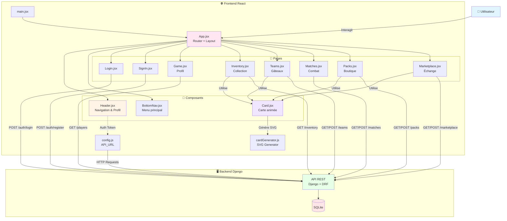
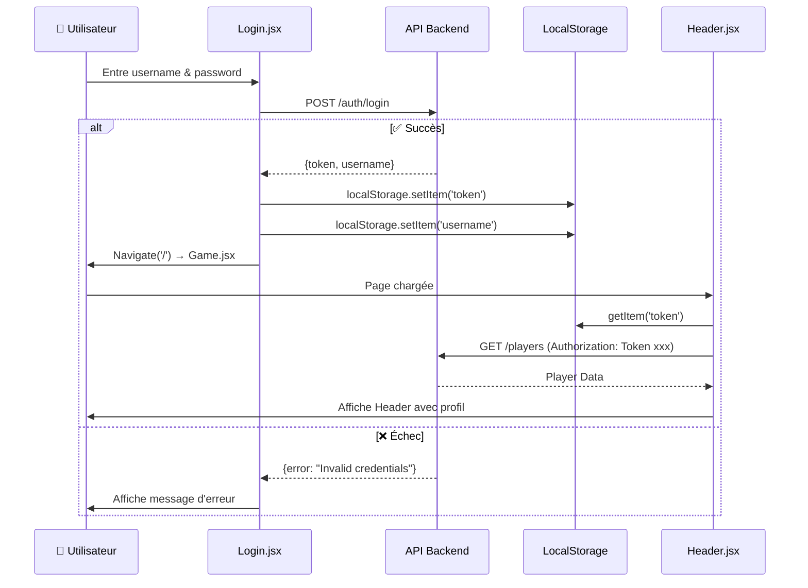
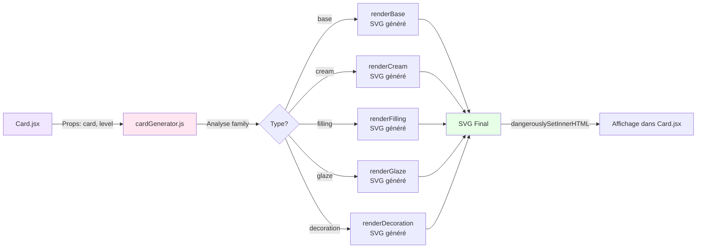
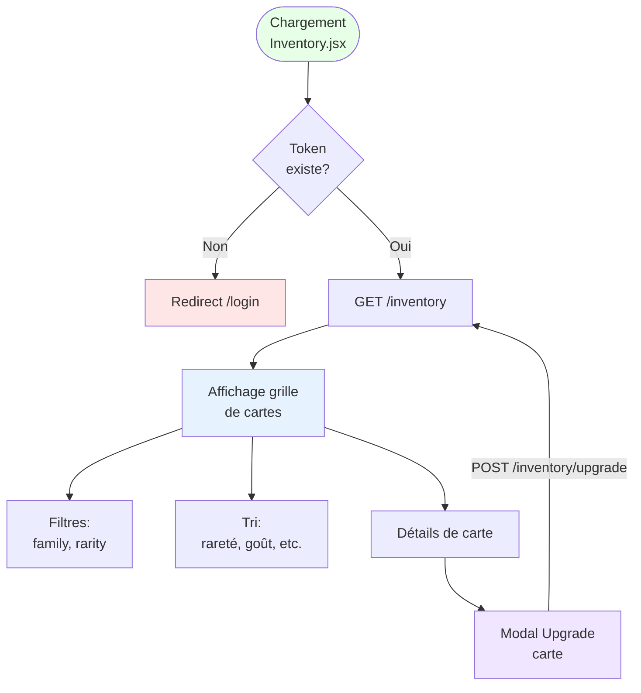
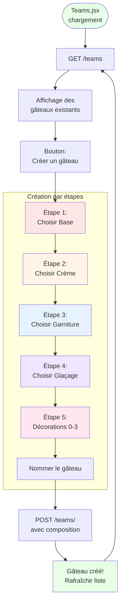
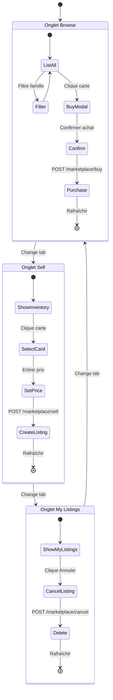
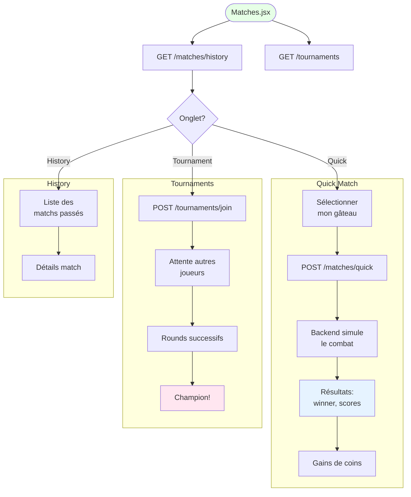
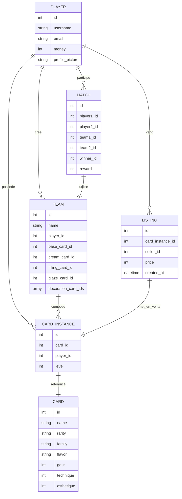

# 📚 Architecture Frontend React - Ultimate Pâtisserie

## 🎯 Vue d'ensemble

Ultimate Pâtisserie est un jeu de cartes de pâtisserie développé avec React, Vite, TailwindCSS et Framer Motion. Les joueurs collectionnent des cartes représentant des éléments de pâtisserie, créent des équipes (gâteaux), participent à des matchs, et échangent sur le marketplace.

---

## 📁 Structure du projet

```
frontend-react/
├── public/                      # Assets statiques
│   ├── generated_bases/         # Images de bases générées
│   ├── generated_decorations/   # Images de décorations générées
│   └── generated_fillings/      # Images de garnitures générées
│
├── src/
│   ├── assets/                  # Resources (images, fonts)
│   │   ├── decorations/         # Images de décorations
│   │   ├── flavors/             # Images de saveurs (vanilla, chocolate, etc.)
│   │   ├── background2.png      # Image de fond principale
│   │   ├── card_backround.png   # Dos de carte (face cachée)
│   │   ├── gout.png             # Icône goût
│   │   ├── tech.png             # Icône technique
│   │   └── estethique.png       # Icône esthétique
│   │
│   ├── components/              # Composants réutilisables
│   │   ├── Header.jsx           # En-tête avec navigation et profil
│   │   ├── BottomNav.jsx        # Navigation en bas d'écran
│   │   └── Card.jsx             # Composant carte animée
│   │
│   ├── pages/                   # Pages de l'application
│   │   ├── Login.jsx            # Page de connexion
│   │   ├── SignIn.jsx           # Page d'inscription
│   │   ├── Game.jsx             # Page profil joueur
│   │   ├── Inventory.jsx        # Collection de cartes
│   │   ├── Teams.jsx            # Création de gâteaux (équipes)
│   │   ├── Matches.jsx          # Matchs et tournois
│   │   ├── Packs.jsx            # Boutique de packs
│   │   └── Marketplace.jsx      # Marketplace pour échanger
│   │
│   ├── App.jsx                  # Composant racine + routing
│   ├── main.jsx                 # Point d'entrée
│   ├── config.js                # Configuration API
│   ├── cardGenerator.js         # Génération SVG dynamique de cartes
│   ├── index.css                # Styles globaux (Tailwind)
│   └── App.css                  # Styles supplémentaires
│
├── index.html                   # HTML principal
├── package.json                 # Dépendances npm
├── vite.config.js              # Configuration Vite
├── tailwind.config.js          # Configuration Tailwind
├── postcss.config.js           # Configuration PostCSS
├── generateBasePNGs.js         # Script génération images bases
└── generateFillingPNGs.js      # Script génération images garnitures
```

---

## 🏗️ Architecture générale



---

## 🔐 Flux d'authentification



---

## 🎴 Système de cartes

### Structure d'une carte

```javascript
{
  id: number,
  name: string,               // ex: "Éclair au Chocolat"
  rarity: string,             // "common" | "uncommon" | "rare" | "epic"
  family: string,             // "base" | "cream" | "filling" | "glaze" | "decoration"
  flavor: string,             // "chocolate" | "vanilla" | "strawberry" | etc.
  gout: number,              // 0-100 (Goût)
  technique: number,         // 0-100 (Technique)
  esthetique: number,        // 0-100 (Esthétique)
  level: number              // Niveau de la carte (upgrade)
}
```

### Génération visuelle (cardGenerator.js)



**Caractéristiques visuelles :**
- Couleurs basées sur `flavor` (dégradés dynamiques)
- Bordures selon `rarity` (gris, bronze, argent, or)
- Effets d'ombrage et de texture pour chaque type
- Animations Framer Motion (hover, flip, slide)

---

## 🗺️ Routing et Navigation

```mermaid
graph TB
    Root[/]
    
    subgraph "🔓 Pages Publiques"
        Login[/login<br/>Login.jsx]
        SignIn[/signin<br/>SignIn.jsx]
    end
    
    subgraph "🔐 Pages Protégées"
        Game[/ <br/>Game.jsx<br/>Profile]
        Inventory[/inventory<br/>Inventory.jsx]
        Teams[/teams<br/>Teams.jsx]
        Matches[/matches<br/>Matches.jsx]
        Packs[/packs<br/>Packs.jsx]
        Market[/marketplace<br/>Marketplace.jsx]
    end
    
    Root -->|Default| Game
    Root -->|No token| Login
    
    Login -->|Success| Game
    SignIn -->|Success| Login
    
    Game -.->|useNavigate| Inventory
    Game -.->|useNavigate| Teams
    Game -.->|useNavigate| Matches
    Game -.->|useNavigate| Packs
    Game -.->|useNavigate| Market
    
    style Login fill:#ffe6e6
    style SignIn fill:#ffe6e6
    style Game fill:#e6ffe6
    style Inventory fill:#e6f3ff
    style Teams fill:#fff4e6
    style Matches fill:#ffe6f0
    style Packs fill:#f0e6ff
    style Market fill:#e6fffa
```

### Protection des routes

Chaque page protégée vérifie la présence du token :

```javascript
useEffect(() => {
  if (!token) {
    navigate('/login');
    return;
  }
  // Charger les données
}, [token, navigate]);
```

---

## 🎮 Flux des pages principales

### 1️⃣ Inventory (Collection)



### 2️⃣ Teams (Création de gâteaux)



**Composition d'un gâteau :**
- **1 Base** (obligatoire)
- **1 Crème** (optionnelle)
- **1 Garniture** (optionnelle)
- **1 Glaçage** (optionnel)
- **0-3 Décorations** (optionnelles)

**Calcul des stats :**
```javascript
total_gout = sum(card.gout for all cards in team)
total_technique = sum(card.technique for all cards)
total_esthetique = sum(card.esthetique for all cards)
overall_score = total_gout + total_technique + total_esthetique
```

### 3️⃣ Packs (Ouverture de packs)

```mermaid
sequenceDiagram
    participant U as 👤 Utilisateur
    participant P as Packs.jsx
    participant A as API
    participant M as Modal Reveal
    
    U->>P: Clique "Ouvrir Pack"
    P->>A: POST /packs/{id}/open
    A->>A: Tire N cartes<br/>selon rareté_boost
    A-->>P: {cards: [...]}
    P->>M: Affiche Modal
    
    loop Pour chaque carte
        M->>U: Carte face cachée<br/>(card_backround.png)
        U->>M: Clique sur carte
        M->>U: Animation flip<br/>Révèle la carte
        U->>M: Bouton "Suivant"
    end
    
    M->>U: Dernière carte révélée
    M->>U: Bouton "Fermer"
    U->>M: Clique Fermer
    M->>P: Recharge liste packs
    
    style U fill:#e1f5ff
    style M fill:#f0e6ff
    style A fill:#e6ffe6
```

**Types de packs :**
- **Bronze** : 3 cartes, common/uncommon
- **Silver** : 5 cartes, uncommon/rare
- **Gold** : 7 cartes, rare/epic

### 4️⃣ Marketplace (Échanges)



### 5️⃣ Matches (Combats)



---

## ⚙️ Configuration et API

### config.js

```javascript
const API_URL =
  import.meta.env.VITE_API_URL ||
  (import.meta.env.DEV
    ? 'http://localhost:8000/api'
    : 'https://ultimatepastry.onrender.com/api');

export default API_URL;
```

**Variables d'environnement :**
- `VITE_API_URL` : Override l'URL de l'API
- Mode DEV : `http://localhost:8000/api`
- Mode PROD : `https://ultimatepastry.onrender.com/api`

### Endpoints API utilisés

| Endpoint | Méthode | Description |
|----------|---------|-------------|
| `/auth/login` | POST | Connexion (retourne token) |
| `/auth/register` | POST | Inscription |
| `/players/` | GET | Infos du joueur connecté |
| `/players/upload_picture/` | POST | Upload photo de profil |
| `/players/cheat_add_money/` | POST | Cheat code +1000 coins |
| `/inventory/` | GET | Collection de cartes |
| `/inventory/upgrade/` | POST | Améliorer une carte |
| `/teams/` | GET/POST | Gâteaux (équipes) |
| `/teams/{id}/delete/` | DELETE | Supprimer un gâteau |
| `/packs/` | GET | Liste des packs disponibles |
| `/packs/{id}/open/` | POST | Ouvrir un pack |
| `/marketplace/` | GET | Annonces marketplace |
| `/marketplace/sell/` | POST | Mettre en vente |
| `/marketplace/buy/` | POST | Acheter une carte |
| `/marketplace/my-listings/` | GET | Mes annonces |
| `/marketplace/cancel/` | POST | Annuler une annonce |
| `/matches/quick/` | POST | Lancer un match rapide |
| `/matches/history/` | GET | Historique des matchs |
| `/tournaments/` | GET | Tournois disponibles |
| `/tournaments/join/` | POST | Rejoindre un tournoi |

---

## 🎨 Styles et animations

### Stack technique

- **TailwindCSS** : Utility-first CSS framework
- **Framer Motion** : Animations fluides et gestuelles
- **Custom CSS** : Styles complémentaires dans `App.css` et `index.css`
- **Google Fonts** : Police "Satisfy" pour le titre

### Animations Framer Motion

#### Card.jsx
```javascript
<motion.div
  initial={{ opacity: 0, y: 50, rotateY: -45 }}
  animate={{ opacity: 1, y: 0, rotateY: 0 }}
  whileHover={{ y: -20, scale: 1.05 }}
  whileTap={{ scale: 0.95 }}
>
```

#### Packs.jsx - Flip card reveal
```javascript
<motion.div
  animate={{ rotateY: cardFlipped ? 180 : 0 }}
  transition={{ duration: 0.6 }}
  style={{ transformStyle: 'preserve-3d' }}
>
  {/* Face avant : dos de carte */}
  {/* Face arrière : carte révélée */}
</motion.div>
```

#### Modales et overlays
```javascript
<AnimatePresence>
  {showModal && (
    <motion.div
      initial={{ opacity: 0 }}
      animate={{ opacity: 1 }}
      exit={{ opacity: 0 }}
    >
      {/* Contenu modal */}
    </motion.div>
  )}
</AnimatePresence>
```

---

## 🛠️ Technologies utilisées

| Technologie | Version | Usage |
|-------------|---------|-------|
| **React** | 19.2.0 | Framework UI |
| **Vite** | 7.3.1 | Build tool ultra-rapide |
| **React Router** | 7.13.1 | Routing SPA |
| **Framer Motion** | 12.35.0 | Animations |
| **TailwindCSS** | 4.2.1 | Styling |
| **@iconify/react** | 6.0.2 | Icônes |
| **Zustand** | 5.0.11 | State management (non utilisé actuellement) |
| **Sharp** | 0.34.5 | Génération d'images PNG |

---

## 🚀 Scripts disponibles

```bash
npm run dev              # Lance le serveur de développement (Vite)
npm run build            # Build de production
npm run preview          # Prévisualisation du build
npm run lint             # Linter ESLint
npm run generate-bases   # Génère les PNGs de bases
npm run generate-fillings # Génère les PNGs de garnitures
```

---

## 🧪 Génération d'images (Scripts Node)

### generateBasePNGs.js
Génère des PNG pour chaque type de base de gâteau à partir des SVG dynamiques du `cardGenerator.js`.

### generateFillingPNGs.js
Génère des PNG pour chaque type de garniture.

**Utilité :** Précalculer les visuels pour optimisation ou utilisation hors navigateur.

---

## 🔒 Sécurité

### Gestion du token

- Token stocké dans `localStorage`
- Envoyé dans chaque requête protégée via header `Authorization: Token xxx`
- Vérification côté backend (Django Rest Framework Token Authentication)

### Protection des routes

```javascript
useEffect(() => {
  const token = localStorage.getItem('token');
  if (!token) {
    navigate('/login');
    return;
  }
  // Suite du chargement...
}, []);
```

### Validation côté backend

Toutes les actions critiques (achat, vente, match, upgrade) sont validées côté serveur.

---

## 🎯 Fonctionnalités clés

### ✅ Implémentées

- ✅ Connexion / Inscription
- ✅ Gestion du profil joueur (photo, argent)
- ✅ Collection de cartes avec filtres et tri
- ✅ Upgrade de cartes (niveaux)
- ✅ Création de gâteaux (Teams) par étapes
- ✅ Ouverture de packs avec animation flip
- ✅ Marketplace : vente, achat, annulation
- ✅ Matchs rapides avec simulation
- ✅ Historique des matchs
- ✅ Cheat code +1000 coins (dev)

### 🔄 En développement / Améliorations possibles

- 🔄 Tournois multi-joueurs temps réel
- 🔄 WebSocket pour notifications live
- 🔄 Classement global (leaderboard)
- 🔄 Achievements / Trophées
- 🔄 Mode dark / light
- 🔄 Internationalisation (i18n)
- 🔄 PWA (Progressive Web App)
- 🔄 Sons et musiques

---

## 📊 Diagramme de données (Frontend)



---

## 🎨 Palette de couleurs

### Thème général : Rose Pâtisserie

- **Rose clair** : `#FBE7F2` - Backgrounds
- **Rose vif** : `#F9A8D4` - Boutons primaires
- **Rose foncé** : `#EC4899` - Accents
- **Jaune** : `#FCD34D` - Coins, badges
- **Violet** : `#A855F7` - Technique
- **Gris** : `#6B7280` - Textes secondaires

### Raretés

- **Common** : Gris `#9CA3AF`
- **Uncommon** : Bronze `#CD7F32`
- **Rare** : Argent `#C0C0C0`
- **Epic** : Or `#FFD700`

---

## 🐛 Debugging et logs

### Console utile

Les pages logguent les erreurs dans la console :

```javascript
console.error('Erreur lors du chargement:', error);
```

### DevTools React

Utilisez l'extension React DevTools pour inspecter l'état des composants.

### Network inspector

Vérifiez les requêtes API dans l'onglet Network du navigateur.

---

## 📦 Déploiement

### Développement local

```bash
cd frontend-react
npm install
npm run dev
# Ouvre http://localhost:5173
```

### Build de production

```bash
npm run build
# Génère le dossier dist/
```

### Serveur de preview

```bash
npm run preview
# Test le build en local
```

### Hébergement

- **Frontend** : Vercel, Netlify, GitHub Pages
- **Backend** : Render, Heroku, Railway

---

## 🔗 Liens utiles

- [React](https://react.dev/)
- [Vite](https://vitejs.dev/)
- [TailwindCSS](https://tailwindcss.com/)
- [Framer Motion](https://www.framer.com/motion/)
- [React Router](https://reactrouter.com/)

---

## 📝 Conclusion

Ce projet est une Single Page Application (SPA) React moderne avec une architecture bien structurée :
- **Composants réutilisables** (Header, BottomNav, Card)
- **Pages découplées** par fonctionnalité
- **Routing fluide** avec React Router
- **Animations soignées** avec Framer Motion
- **Communication API REST** avec Django backend
- **Génération SVG dynamique** pour les cartes

Le code est **maintenable**, **extensible**, et **performant**.

---

**🎉 Bon jeu et bonne pâtisserie !**
