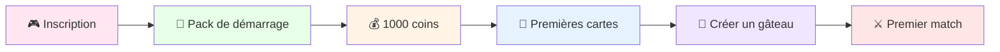
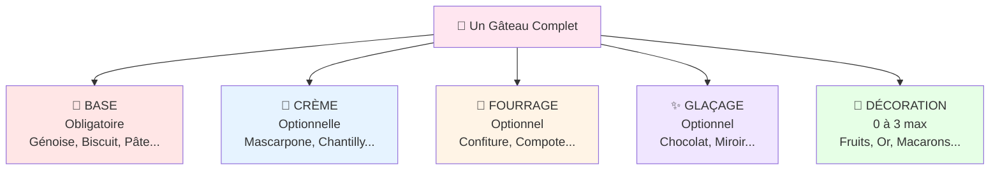
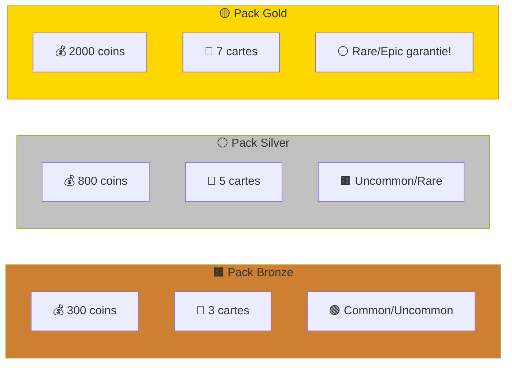
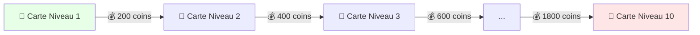
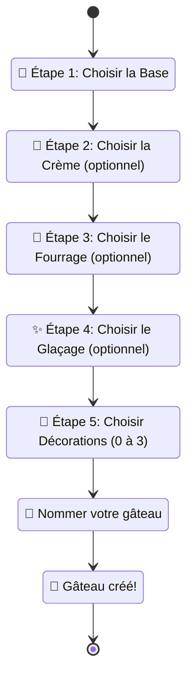
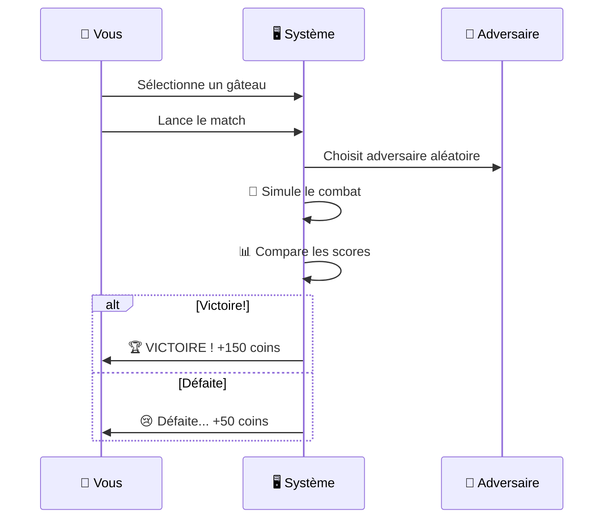
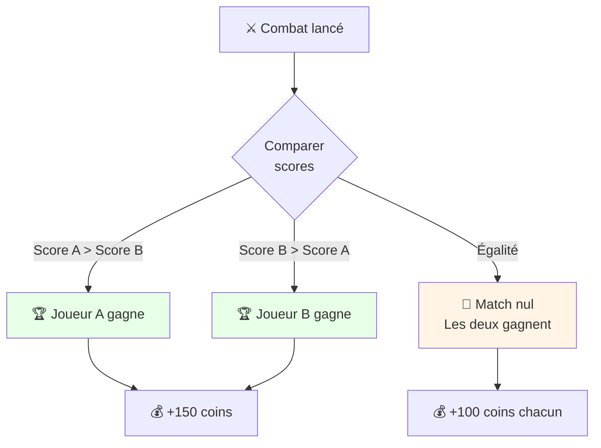
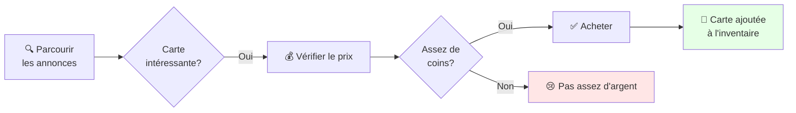
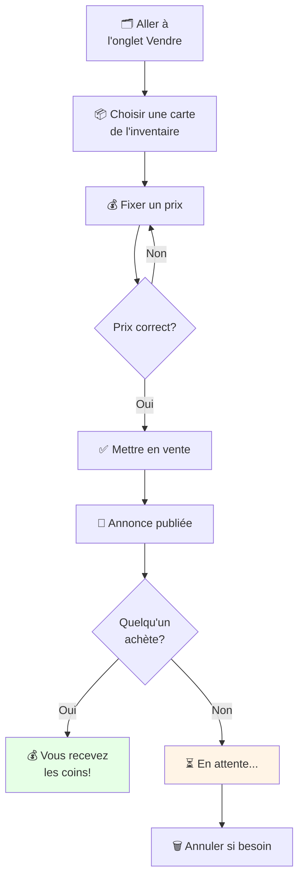
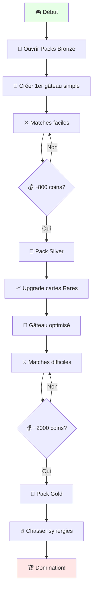

# 🎂 Ultimate Pâtisserie - Règles du Jeu

## 🎯 Objectif du jeu

Devenez le meilleur pâtissier en créant les gâteaux les plus délicieux et impressionnants ! Collectionnez des cartes d'ingrédients, composez des recettes stratégiques, et affrontez d'autres joueurs dans des duels pâtissiers épiques.

---

## 📚 Table des matières

1. [Démarrage](#-démarrage)
2. [Les Cartes](#-les-cartes)
3. [Votre Collection](#-votre-collection)
4. [Créer un Gâteau](#-créer-un-gâteau)
5. [Les Combats](#-les-combats)
6. [Le Marketplace](#-le-marketplace)
7. [Conseils Stratégiques](#-conseils-stratégiques)

---

## 🚀 Démarrage

### Premier lancement



### Monnaie du jeu

- **💰 Coins** : La monnaie du jeu
  - Départ : **1000 coins**
  - Gagner des coins : matchs gagnés, ventes sur le marketplace
  - Dépenser : acheter des packs, acheter des cartes

---

## 🎴 Les Cartes

### Familles de cartes

Il existe **5 familles** d'ingrédients pour composer vos gâteaux :



### Raretés des cartes

Plus une carte est rare, plus elle est puissante !

| Rareté | Couleur | Puissance | Pack Bronze | Pack Silver | Pack Gold |
|--------|---------|-----------|-------------|-------------|-----------|
| 🟤 **Common** | Gris | ⭐ | 80% | 50% | 25% |
| 🟫 **Uncommon** | Bronze | ⭐⭐ | 15% | 30% | 30% |
| ⚪ **Rare** | Argent | ⭐⭐⭐ | 4% | 15% | 35% |
| 🟡 **Epic** | Or | ⭐⭐⭐⭐ | 1% | 5% | 10% |

**Probabilités d'obtention selon le type de pack :**
- 🟫 **Pack Bronze (300 coins)** : Idéal pour débuter, beaucoup de cartes communes
- ⚪ **Pack Silver (800 coins)** : Meilleur équilibre, 20% de chance d'obtenir une Rare ou Epic
- 🟡 **Pack Gold (2000 coins)** : Le meilleur investissement, 45% de chance d'obtenir une Rare ou Epic !

### Statistiques des cartes

Chaque carte possède **3 statistiques** qui déterminent sa force :

```
┌─────────────────────────┐
│  🎴 Génoise Chocolat    │
│  ━━━━━━━━━━━━━━━━━━━━━━│
│                         │
│  😋 GOÛT       : 45/100 │ ← Le plus important ! (×1.5)
│  🔧 TECHNIQUE  : 30/100 │ ← Maîtrise culinaire
│  ✨ ESTHÉTIQUE : 25/100 │ ← Beauté visuelle
│                         │
│  🍫 Saveur: Chocolat    │
│  📚 Famille: Base       │
│  ⚪ Rareté: Rare        │
└─────────────────────────┘
```

### Niveaux des cartes

Les cartes peuvent être **améliorées** du niveau 1 au niveau 10 !

- 📈 Chaque niveau augmente les statistiques
- 💎 Coût : Augmente à chaque niveau
- 🎯 Stratégie : Améliorez vos meilleures cartes en priorité

**Exemple :**
```
Niveau 1 : Génoise (30 goût, 20 tech, 15 esth)
Niveau 5 : Génoise (50 goût, 35 tech, 28 esth)
Niveau 10: Génoise (75 goût, 55 tech, 45 esth)
```

### Saveurs

Chaque carte possède une **saveur** qui influence les synergies :

🍫 Chocolat | 🍓 Fraise | 🍋 Citron | 🍦 Vanille | 🥜 Noisette
🍒 Cerise | 🫐 Myrtille | 🍯 Caramel | ☕ Café | 🍏 Pomme
🥥 Coco | 🌰 Châtaigne | 🧈 Beurre | 🥛 Crème | 🧁 Neutre

---

## 📦 Obtenir des Cartes

### Les Packs

Il existe **3 types de packs** à acheter dans la boutique :



### Animation d'ouverture

Quand vous ouvrez un pack :

1. **🎁 Cartes mystères** : Face cachée avec dos de carte
2. **👆 Cliquez** pour révéler chaque carte
3. **🔄 Animation flip** : La carte se retourne avec effet 3D
4. **✨ Révélation** : Découvrez votre nouvelle carte !
5. **➡️ Suivante** : Passez à la carte suivante

---

## 🗂️ Votre Collection

### Page Inventaire

Consultez toutes vos cartes dans l'inventaire !

**Filtres disponibles :**
- 📚 **Par famille** : Base, Crème, Fourrage, Glaçage, Décoration, Toutes
- ⭐ **Par rareté** : Common, Uncommon, Rare, Epic, Toutes

**Actions possibles :**
- 🔍 **Voir les détails** : Cliquez sur une carte
- 📈 **Améliorer** : Augmentez le niveau (coûte des coins)
- 💰 **Vendre** : Mettez en vente sur le marketplace

### Amélioration (Upgrade)



**Conseil :** Priorisez l'amélioration de vos cartes **Epic** et **Rare** !

---

## 🎂 Créer un Gâteau

### Composition d'un gâteau

Un gâteau (appelé "Team") est une **combinaison de cartes** :

```
✅ OBLIGATOIRE:
  └─ 1 Base (le fondement du gâteau)

❓ OPTIONNEL:
  ├─ 1 Crème
  ├─ 1 Fourrage
  ├─ 1 Glaçage
  └─ 0 à 3 Décorations (maximum 3 !)
```

### Processus de création



### Visualisation 3D

Une fois créé, votre gâteau s'affiche en **3D** avec toutes ses couches empilées !

```
        🍒 Décorations (fruits, or...)
        ━━━━━━━━━━━━━━━━
        ✨ Glaçage coulant
        ━━━━━━━━━━━━━━━━
    🥛 Crème (cylindre lisse)
        ━━━━━━━━━━━━━━━━
    🍓 Fourrage (texture)
        ━━━━━━━━━━━━━━━━
    🍰 Base (génoise, biscuit...)
```

---

## ⚔️ Les Combats (Matches)

### Types de combats

#### 🎯 Match Rapide (Quick Match)



**Récompenses :**
- 🏆 **Victoire** : +150 coins
- 😢 **Défaite** : +50 coins (consolation)

#### 🏆 Tournois

Les tournois sont des compétitions spéciales avec des **bonus** thématiques !

**Exemple : Semaine du Glaçage**
- ✨ Esthétique compte **double** (×2)
- 🎨 Glaçages rares donnent +10% de bonus
- 🏅 Récompenses augmentées

### Calcul du Score

Le score d'un gâteau est calculé en **3 étapes** :

#### 📊 Étape 1 : Score Brut

```
Score Brut = (Σ Goûts × 1.5) + (Σ Techniques × 1.0) + (Σ Esthétiques × 1.0)
```

**Le Goût est le plus important** : il compte 1.5× !

**Exemple :**
```
Gâteau composé de :
  - Base : 30 goût, 20 tech, 15 esth
  - Crème : 25 goût, 22 tech, 18 esth
  - Glaçage : 20 goût, 15 tech, 30 esth

Calcul :
  Goûts : (30 + 25 + 20) × 1.5 = 112.5
  Techniques : 20 + 22 + 15 = 57
  Esthétiques : 15 + 18 + 30 = 63
  
  Score Brut = 112.5 + 57 + 63 = 232.5
```

#### 🔗 Étape 2 : Bonus de Synergies

Les **synergies** sont des combos qui donnent des bonus puissants !

##### Type 1 : Synergies de Saveur

**3 cartes ou plus avec la même saveur = +15%**

```
Exemple :
  Base Chocolat + Crème Chocolat + Glaçage Chocolat
  → 🍫 Synergie Chocolat : +15%
```

##### Type 2 : Synergies Techniques

**Certaines combinaisons logiques donnent des bonus :**

| Combo | Bonus | Raison |
|-------|-------|--------|
| Génoise + Mascarpone | +15% | Classique italien |
| Pâte Feuilletée + Chantilly | +12% | Millefeuille |
| Pâte Sablée + Crème Pâtissière | +10% | Tarte traditionnelle |
| Dacquoise + Praliné | +15% | Mariage parfait |

##### Type 3 : Synergies Signature (Légendaires!)

**Recettes complètes ultra-puissantes :**

```
🍓 FRAISIER ROYAL (+25%)
  ✓ Génoise
  ✓ Mascarpone
  ✓ Coulis/Confiture Fraise
  ✓ Miroir
  ✓ Fruits Rouges (décoration)
  
🍫 TARTE CHOCO-CARAMEL (+30%)
  ✓ Pâte Sablée
  ✓ Caramel
  ✓ Chocolat
  ✓ Or Alimentaire (décoration)
  
🥮 OPERA CAKE (+28%)
  ✓ Biscuit Joconde
  ✓ Crème au Beurre Café
  ✓ Ganache Chocolat
  ✓ Glaçage Chocolat
```

**Les synergies s'additionnent !**
```
Exemple :
  Fraisier Royal détecté : +25%
  3 cartes Fruité : +15%
  Génoise + Mascarpone : +15%
  
  TOTAL : +55% ! 🔥
```

#### ⚡ Étape 3 : Score Final

```
Score Final = Score Brut × (1 + Bonus Synergies)
```

**Exemple complet :**
```
Score Brut : 232.5
Bonus Synergies : +40% (0.40)

Score Final = 232.5 × (1 + 0.40)
            = 232.5 × 1.40
            = 325.5

🎉 Votre gâteau vaut 325.5 points !
```

### Qui gagne ?



**Le gâteau avec le score final le plus élevé gagne !**

---

## 🛒 Le Marketplace

### Acheter des cartes



**Filtres :**
- 📚 Par famille (Base, Crème, etc.)
- ⭐ Par rareté
- 💰 Par prix

### Vendre des cartes



**Conseils de prix :**
- 🟤 Common : 50-100 coins
- 🟫 Uncommon : 150-300 coins
- ⚪ Rare : 400-800 coins
- 🟡 Epic : 1000-3000 coins

**Prix augmente avec le niveau !**
```
Rare Niveau 1 → ~500 coins
Rare Niveau 5 → ~1200 coins
Rare Niveau 10 → ~2500 coins
```

### Annuler une vente

Si votre carte ne se vend pas ou si vous changez d'avis :
1. Allez dans **"Mes annonces"**
2. Cliquez sur **"Annuler"**
3. La carte retourne dans votre inventaire !

---

## 💡 Conseils Stratégiques

### 🎯 Pour débutants

#### 1. Commencez par un gâteau simple
```
✅ Bonne première composition :
  - 1 Base (n'importe laquelle)
  - 1 Crème
  - 1 Glaçage
  
❌ Évitez de trop compliquer au début !
```

#### 2. Améliorez progressivement
- Ne débloquez pas tout de suite niveau 10
- Montez toutes vos cartes à niveau 2-3 d'abord
- Concentrez-vous sur 1 gâteau principal

#### 3. Économisez vos coins
```
💰 Budget intelligent :
  - 30% : Packs (nouvelles cartes)
  - 40% : Upgrades (améliorer l'existant)
  - 30% : Marketplace (cartes spécifiques)
```

### 🔥 Pour avancés

#### 1. Chassez les synergies

**Priorisez les recettes Signature !**

```
Étapes pour un Fraisier Royal :
  1. ✅ Obtenir Génoise (facile)
  2. 🔍 Chercher Mascarpone (au marketplace)
  3. 🔍 Trouver Miroir de glaçage
  4. 🎲 Ouvrir des packs pour Fruits Rouges
  5. 🎉 Assembler tout → +25% garanti !
```

#### 2. Spécialisez vos gâteaux

**Créez plusieurs gâteaux pour différentes stratégies :**

```
🍫 "Chocolat Explosif"
  → Toutes saveurs Chocolat
  → Focus Goût
  → Pour tournois classiques

✨ "Beauty Queen"
  → Focus Esthétique
  → Glaçages + Décos rares
  → Pour tournois Esthétique

🔧 "Technique Pure"
  → Focus Technique
  → Pâtes complexes
  → Pour tournois Technique
```

#### 3. Marketplace : Jouez le marché

**Stratégie d'achat-revente :**
```
1. 🔍 Repérez cartes sous-évaluées
2. 💰 Achetez-les
3. 📈 Améliorez-les de quelques niveaux
4. 💎 Revendez avec profit !

Exemple :
  Acheter Rare Niv.1 → 400 coins
  Upgrade → Niv.3 → 400 coins de coût
  Revendre Niv.3 → 1200 coins
  
  Profit : 1200 - 800 = 400 coins ! 📈
```

#### 4. Min-Max vos stats

**Optimisez selon l'objectif :**

Pour matchs normaux :
```
Goût × 1.5 est prioritaire !
→ Choisissez cartes avec HAUT Goût
```

Pour tournois Esthétique :
```
Esthétique × 2 dans ce cas
→ Adaptez votre gâteau !
```

### 🧠 Méta-stratégie

#### Progression optimale



#### Composition ultime (Très difficile à obtenir)

```
🏆 LE GÂTEAU PARFAIT

Base : Génoise Chocolat Epic Niv.10
  → 80 goût, 60 tech, 50 esth
  
Crème : Mascarpone Rare Niv.10
  → 65 goût, 70 tech, 55 esth
  
Fourrage : Ganache Chocolat Epic Niv.10
  → 75 goût, 65 tech, 60 esth
  
Glaçage : Miroir Rare Niv.10
  → 50 goût, 55 tech, 85 esth
  
Décos : 
  - Fruits Rouges Epic Niv.10
  - Or Alimentaire Rare Niv.10
  - Macarons Rare Niv.10

Synergies détectées :
  ✓ Fraisier Royal : +25%
  ✓ 3+ Chocolat : +15%
  ✓ Génoise + Mascarpone : +15%
  
TOTAL BONUS : +55%

Score estimé : ~900 points 🔥
```

---

## ❓ FAQ

### Q : Combien de gâteaux puis-je créer ?
**R :** Illimité ! Créez autant de compositions que vous voulez.

### Q : Puis-je récupérer les cartes d'un gâteau ?
**R :** Oui ! Supprimez le gâteau et les cartes retournent à l'inventaire.

### Q : Les cartes disparaissent après un match ?
**R :** Non, elles restent éternellement dans votre collection.

### Q : Quelle est la meilleure rareté à améliorer ?
**R :** Les **Epic** d'abord, puis les **Rare**. Les Common ne valent pas trop d'investissement.

### Q : Comment obtenir plus de coins rapidement ?
**R :** 
1. Gagnez des matchs (150 coins/victoire)
2. Vendez vos cartes en double
3. Améliorez puis revendez (trading)

### Q : Les synergies sont-elles obligatoires ?
**R :** Non, mais elles font une ÉNORME différence. Un bon gâteau avec synergies bat facilement un gâteau puissant sans synergies.

### Q : Combien coûte un upgrade ?
**R :**
```
Niv 1→2 : 200 coins
Niv 2→3 : 400 coins
Niv 3→4 : 600 coins
...
Niv 9→10 : 1800 coins

Total Niv 1→10 : ~9000 coins
```

### Q : Le Marketplace prend-il une commission ?
**R :** Non actuellement ! Vous recevez 100% du prix de vente.

---

## 🎮 Modes de Jeu

### Actuellement disponibles

✅ **Match Rapide** : Combat 1v1 instantané
✅ **Historique** : Voir tous vos anciens matchs
✅ **Tournois** : Événements spéciaux avec bonus

### 🔜 À venir (Futures mises à jour)

🔜 **Mode Campagne** : Histoire et défis progressifs
🔜 **Classement Global** : Leaderboard mondial
🔜 **Défis Quotidiens** : Missions journalières avec récompenses
🔜 **Matchs Multijoueurs** : Combats en temps réel
🔜 **Guildes** : Rejoignez une équipe de pâtissiers
🔜 **Événements Saisonniers** : Cartes exclusives limitées

---

## 🏆 Système de Progression

### Niveaux de joueur

```
🥉 Apprenti Pâtissier (0-500 points)
  → Découverte du jeu
  
🥈 Pâtissier Confirmé (500-2000 points)
  → Maîtrise des bases
  
🥇 Maître Pâtissier (2000-5000 points)
  → Synergies avancées
  
💎 Chef Pâtissier (5000-10000 points)
  → Expert des combos
  
👑 Légende Sucrée (10000+ points)
  → Élite absolue
```

**Points gagnés :**
- 🏆 Victoire : +10 points
- 😢 Défaite : +2 points
- 🏅 Tournoi Top 3 : +50 points

---

## 🎨 Personnalisation

### Photo de profil

Personnalisez votre profil depuis la page **Game** (accueil) :
1. Cliquez sur votre photo de profil
2. Sélectionnez une image (max 5MB)
3. Validation automatique !

### Nom de gâteau

Soyez créatif avec vos noms de gâteaux :
```
Exemples :
  - "La Tour Chocolatée"
  - "Fraise-toi des Ennuis"
  - "Le Citron Givré"
  - "Vanille Extreme"
  - "Noisette Fatale"
```

---

## 🔧 Astuces Techniques

### Cheat Code (Mode développement)

Un code secret existe pour obtenir rapidement des coins ! 🤫

```
💰 Cliquez sur votre nombre de coins en haut
→ +1000 coins instantanés !
```

⚠️ **Note :** Ce code peut être désactivé en production.

---

## 📊 Statistiques à suivre

### Votre Dashboard

Consultez vos performances :
- 🎂 Nombre de gâteaux créés
- ⚔️ Matchs joués
- 🏆 Taux de victoire
- 💰 Coins totaux gagnés
- 🎴 Cartes collectées
- ⭐ Cartes Epic possédées

---

## 🎯 Défis Personnels

### Objectifs pour progresser

#### Débutant
- [ ] Créer votre premier gâteau
- [ ] Gagner 5 matchs
- [ ] Obtenir 1 carte Rare
- [ ] Atteindre 3000 coins

#### Intermédiaire
- [ ] Déclencher votre première synergie
- [ ] Améliorer une carte au niveau 5
- [ ] Créer 3 gâteaux différents
- [ ] Gagner 20 matchs

#### Avancé
- [ ] Obtenir une carte Epic
- [ ] Déclencher une synergie Signature
- [ ] Améliorer une carte au niveau 10
- [ ] Atteindre 10,000 coins
- [ ] Gagner 50 matchs

#### Expert
- [ ] Collectionner toutes les cartes Epic
- [ ] Créer le "Gâteau Parfait"
- [ ] Gagner un tournoi
- [ ] Atteindre 50,000 coins
- [ ] Devenir Légende Sucrée

---

## 🌟 Conclusion

**Ultimate Pâtisserie** mêle stratégie, collection et combats dans un univers gourmand et coloré ! 

```
🎯 Collectionnez → 🎂 Composez → ⚔️ Combattez → 🏆 Dominez
```

**Bonne chance, et que le meilleur pâtissier gagne ! 🍰👨‍🍳**

---

**💬 Besoin d'aide ?**  
Consultez l'[ARCHITECTURE.md](ARCHITECTURE.md) pour comprendre le fonctionnement technique du jeu.

**🎮 Bon jeu !**
